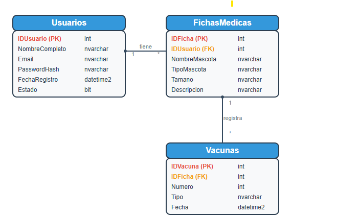

# petShop

# 🩺 Ficha Médica - Proyecto Técnico

Este proyecto es una aplicación ASP.NET Core MVC para el manejo de fichas médicas de pacientes. Permite crear, editar, eliminar y listar fichas médicas asociadas a usuarios y vacunas.

---

## ⚙️ Tecnologías utilizadas

- ASP.NET Core MVC
- Entity Framework Core (Code First)
- SQL Server
- Bootstrap (opcional)
- Visual Studio o Visual Studio Code

---

## 📁 Estructura del proyecto

- `/Models` - Modelos de datos (`FichaMedica`, `Usuario`, `Vacuna`, etc.)
- `/Views` - Vistas Razor
- `/Controllers` - Controladores MVC
- `/Data` - Contiene `AppDbContext.cs`
- `/Migrations` - Migraciones generadas por Entity Framework Core

---

## 🧪 Cómo correr el proyecto

Este proyecto utiliza **Code First**, es decir, la base de datos se genera automáticamente a partir de las clases de modelo mediante **migraciones**. **No necesitas scripts SQL manuales**, solo ejecutar las migraciones.

---

---

## 🖼️ Diagrama Entidad-Relación



---


### 🔁 1. Clonar el repositorio

```bash
git clone https://github.com/osdarove/petShop.git
cd petShop

